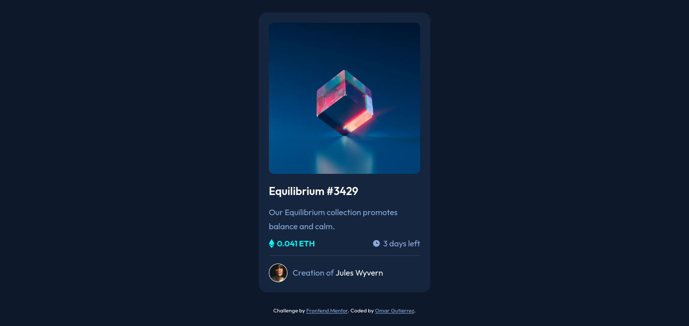
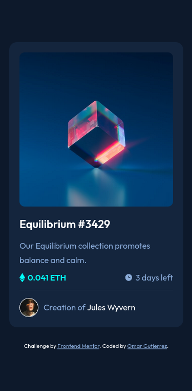

# Frontend Mentor - NFT preview card component solution

This is a solution to the [NFT preview card component challenge on Frontend Mentor](https://www.frontendmentor.io/challenges/nft-preview-card-component-SbdUL_w0U). Frontend Mentor challenges help you improve your coding skills by building realistic projects. 

## Table of contents

- [Overview](#overview)
  - [Screenshot](#screenshot)
  - [Links](#links)
- [My process](#my-process)
  - [Built with](#built-with)
  - [What I learned](#what-i-learned)
  - [Continued development](#continued-development)
- [Author](#author)
- [Acknowledgments](#acknowledgments)

**Note: Delete this note and update the table of contents based on what sections you keep.**

## Overview

### Screenshot

**Desktop**



**Mobile**



### Links

- Solution URL: [Add solution URL here](https://your-solution-url.com)
- Live Site URL: [Add live site URL here](https://your-live-site-url.com)

## My process

### Built with

- Semantic HTML5 markup
- CSS custom properties
- Flexbox
- CSS BEM Methond
- Mobile-first workflow

### What I learned

I've learned how to give an effect hover to an image. I needed to wrap the
image with a sibling div. Also, I practiced BEM method in CSS.

```html
<div class="img-container">
  
  <div class="img-preview">
    <svg width="48" height="48" xmlns="http://www.w3.org/2000/svg"><g fill="none" fill-rule="evenodd"><path d="M0 0h48v48H0z"/><path d="M24 9C14 9 5.46 15.22 2 24c3.46 8.78 12 15 22 15 10.01 0 18.54-6.22 22-15-3.46-8.78-11.99-15-22-15Zm0 25c-5.52 0-10-4.48-10-10s4.48-10 10-10 10 4.48 10 10-4.48 10-10 10Zm0-16c-3.31 0-6 2.69-6 6s2.69 6 6 6 6-2.69 6-6-2.69-6-6-6Z" fill="#FFF" fill-rule="nonzero"/></g></svg>
</div>
```

### Continued development

I need to redefine the html layout and learn more about the use of variables in CSS.

## Author

- Frontend Mentor - [@omargtdev](https://www.frontendmentor.io/profile/omargtdev)
- Twitter - [@omargtdev](https://www.twitter.com/omargtdev)

## Acknowledgments

I think to do projects are better than read or watch videos all the time about Web devlopment, I'm not saying
you don't need to study or don't have knowledge about them (HTML, CSS), on the contrary, you only need
a little base to start to build something. For me, that is the best thing to learn and also it is fun!
